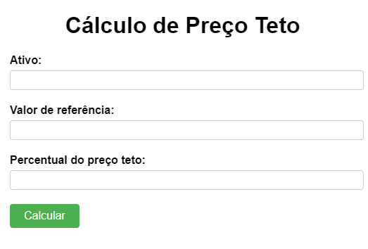

# Preço Teto




## Descrição do Projeto
Este projeto tem como objetivo colocar em prática os conceitos de **HTML**, **CSS** e **JavaScript** adquiridos ao longo de diversos cursos. O projeto principal é um aplicativo web chamado **"Preço Teto"**, que permite calcular o preço teto de um ativo financeiro (ação, fundo imobiliário ou qualquer outro ativo com histórico de preços).

## Funcionalidade Principal
O usuário fornecerá três entradas obrigatórias, e o sistema calculará o preço teto com base nesses valores.

### **Entradas (INPUT)**
- **ATIVO**: Nome ou código do ativo financeiro.
- **VALOR DE REFERÊNCIA**: Valor atual ou referencial do ativo.
- **PERCENTUAL DO PREÇO TETO**: Percentual aplicado ao valor de referência para definir o preço teto.

### **Saída (OUTPUT)**
- Cálculo do **preço teto** com base nos valores fornecidos pelo usuário.

## Estrutura do Projeto
O projeto é composto pelos seguintes arquivos:
```
    index.html   // Estrutura da página
    script.js    // Lógica e interatividade
    styles.css   // Estilização da página
```

## Como Utilizar
1. Clone este repositório:
   ```bash
   git clone https://github.com/DemethriusSR/HTML---CSS
   ```
2. Abra o arquivo **index.html** em um navegador.
3. Insira os valores nos campos obrigatórios.
4. Clique no botão para calcular o preço teto.
5. Veja o resultado calculado na tela.

## Tecnologias Utilizadas
- **HTML**: Estrutura do site.
- **CSS**: Estilização e responsividade.
- **JavaScript**: Cálculo do preço teto e interatividade.

## Contribuição
Contribuições são bem-vindas! Para contribuir, siga os passos:
1. Fork este repositório.
2. Crie uma branch com sua funcionalidade: `git checkout -b minha-feature`
3. Commit suas modificações: `git commit -m 'Adicionando nova funcionalidade'`
4. Envie para o repositório remoto: `git push origin minha-feature`
5. Abra um Pull Request.

## Licença
Este projeto está sob a licença MIT. Sinta-se à vontade para utilizá-lo e modificá-lo conforme necessário.

---
**Desenvolvido para aprendizado e prática de HTML, CSS e JavaScript.**

